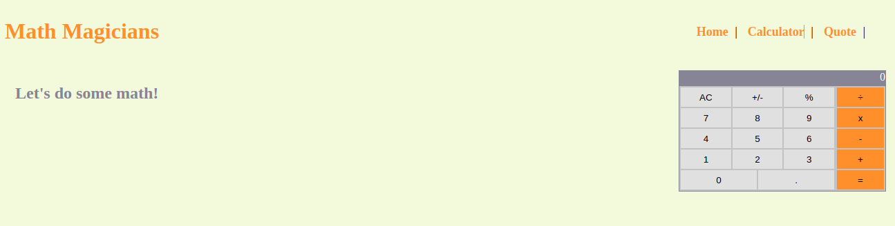

# Math Magicians

> Single Page Application that explains about math and has a calculator widget

The objective of this exercise was to install React using create-react-app and set up linters and README. 
Later, we had to assemble a calculator using React, and the provided calculator code. Then, we had to create three pages
and their navigation using React Router. The final objective was to write and run unit, component and ui tests using Jest and React Testing Library.

## Built With

- JavaScript/React
- React Events
- React Hooks
- React Router
- JSX
- CSS
- VSCode
- Webpack
- Babel
- Ubuntu 20.04
- Linters

## Setup

- Get the link of the repository: `git@github.com:arthurborgesdev/math-magicians.git`
- Clone it as `git clone git@github.com:arthurborgesdev/math-magicians.git` on a Terminal

## Usage

- Run `npm install` on a Terminal to install the modules
- Run `yarn start` on a Terminal to start the server 
- Open [http://localhost:3000](http://localhost:3000) to view it in the browser.

## Tests

- Run `npm run test` on a Terminal to run the test suite
- Select option letter `a` to run all the tests in the repository

## Deploy

- Application is deployed in [Heroku](https://math-magicians-arthur.herokuapp.com) and [Netlify](https://hopeful-tesla-4ad625.netlify.app/).

## Authors

👤 **Arthur Borges**

- GitHub: [@arthuborgesdev](https://github.com/arthurborgesdev)
- Twitter: [@arthurmoises](https://twitter.com/arthurmoises)
- LinkedIn: [Arthur Borges](https://linkedin.com/in/arthurmoises)

👤 **Mih Julius Ndim**

- Github: [@Mihndim2020](https://github.com/Mihndim2020)
- Twitter: [@mihndim](https://github.com/mih-julius) 
- Linkedin: [Mih Julius](https://www.linkedin.com/mih-julius)

## 🤝 Contributing

Contributions, issues, and feature requests are welcome!

## Show your support

Give a ⭐️ if you like this project!

## Acknowledgments

- Microverse
- React documentation
- Lots and lots of Stack Overflow questions and answers